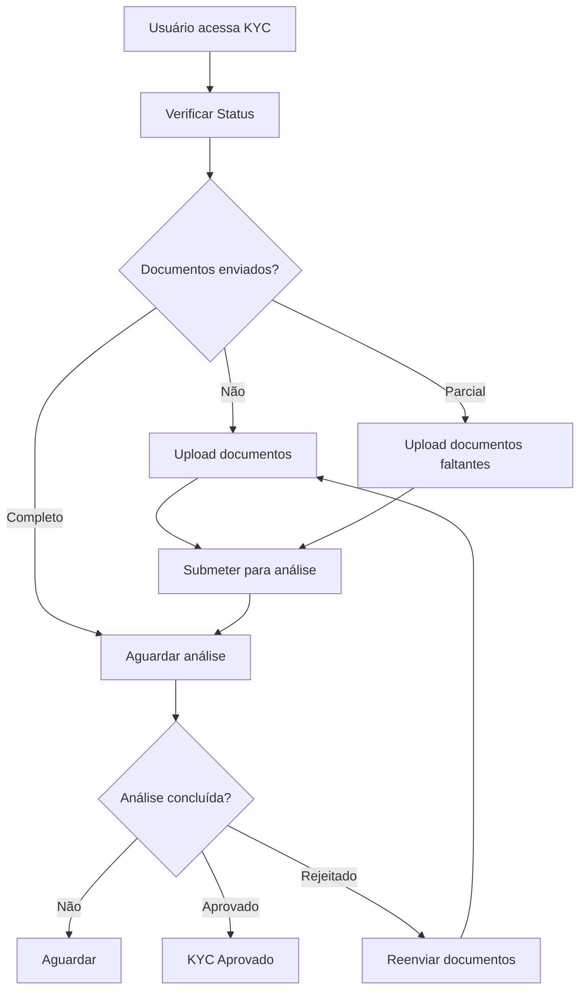
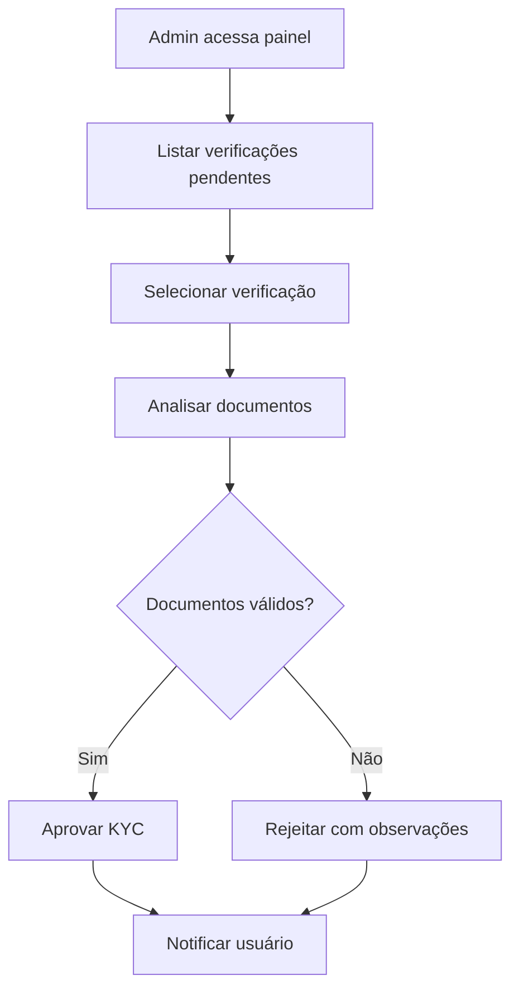

# Documentação - Sistema KYC (routes/kyc.js)

## Visão Geral
Sistema completo de Know Your Customer (KYC) para verificação de identidade e documentos. Permite upload de documentos, gerenciamento de status de verificação e processo de aprovação/rejeição.

## Características Principais
- **Upload de Documentos**: RG, comprovante de residência, comprovante de renda
- **Verificação Manual**: Processo de aprovação por administradores
- **Status Tracking**: Acompanhamento do progresso da verificação
- **Rate Limiting**: Proteção contra uploads excessivos
- **Segurança**: Validação de tipos de arquivo e tamanhos
- **Auditoria**: Log completo de todas as ações

## Status de Verificação KYC

| Status | Descrição | Ações Disponíveis |
|--------|-----------|-------------------|
| `not_started` | Nenhum documento enviado | Upload de documentos |
| `incomplete` | Documentos parciais enviados | Upload de documentos faltantes |
| `pending_review` | Todos documentos enviados, aguardando análise | Aguardar aprovação |
| `approved` | Verificação aprovada | Nenhuma ação necessária |
| `rejected` | Verificação rejeitada | Reenvio de documentos |

## Tipos de Documento

| Tipo | Obrigatório | Formato | Tamanho Máximo | Descrição |
|------|-------------|---------|----------------|-----------|
| `rg_front` | ✅ | JPG, PNG, PDF | 5MB | RG frente |
| `rg_back` | ✅ | JPG, PNG, PDF | 5MB | RG verso |
| `address_proof` | ✅ | JPG, PNG, PDF | 5MB | Comprovante de residência |
| `income_proof` | ❌ | JPG, PNG, PDF | 5MB | Comprovante de renda |

## Rotas Implementadas

### 1. Upload de Documento

#### `POST /api/kyc/upload`
**Descrição**: Upload de documento KYC (multipart/form-data)
**Acesso**: Usuário autenticado
**Rate Limit**: 20 uploads por 15 minutos

**Form Data**:
- `file`: Arquivo do documento (required)
- `documentType`: Tipo do documento (required)

**Response Success**:
```json
{
  "success": true,
  "message": "Documento enviado com sucesso",
  "document": {
    "type": "rg_front",
    "filename": "rg_front-1704110400000-123456789.jpg",
    "originalName": "meu_rg_frente.jpg",
    "size": 2048576,
    "uploadedAt": "2024-01-01T12:00:00Z"
  },
  "kycStatus": "incomplete"
}
```

**Response Error - Tipo Inválido**:
```json
{
  "error": "Tipo de documento inválido",
  "type": "validation_error",
  "allowedTypes": ["rg_front", "rg_back", "address_proof", "income_proof"]
}
```

**Response Error - Arquivo Inválido**:
```json
{
  "error": "Tipo de arquivo não permitido. Use JPG, PNG ou PDF.",
  "type": "file_error"
}
```

**Response Error - Rate Limit**:
```json
{
  "error": "Muitas tentativas de upload. Tente novamente em 15 minutos.",
  "type": "upload_rate_limit"
}
```

### 2. Atualização de Status (Admin)

#### `PUT /api/kyc/update-status`
**Descrição**: Atualizar status de verificação KYC (apenas admins)
**Acesso**: Administrador

```javascript
// Payload de exemplo
{
  "userId": "user-123",
  "status": "approved", // pending_review, approved, rejected
  "notes": "Documentos válidos e verificados"
}
```

**Response Success**:
```json
{
  "success": true,
  "message": "Status KYC atualizado com sucesso",
  "user": {
    "id": "user-123",
    "kycStatus": "approved",
    "updatedAt": "2024-01-01T12:00:00Z"
  }
}
```

**Response Error - Permissão**:
```json
{
  "error": "Acesso negado. Apenas administradores podem atualizar status KYC",
  "type": "permission_error"
}
```

**Response Error - Status Inválido**:
```json
{
  "error": "Status inválido",
  "type": "validation_error",
  "validStatuses": ["pending_review", "approved", "rejected"]
}
```

### 3. Listar Documentos

#### `GET /api/kyc/documents`
**Descrição**: Listar documentos KYC do usuário
**Acesso**: Usuário autenticado

**Response Success**:
```json
{
  "success": true,
  "documents": {
    "rg_front": {
      "originalName": "meu_rg_frente.jpg",
      "size": 2048576,
      "uploadedAt": "2024-01-01T10:00:00Z",
      "status": "pending"
    },
    "rg_back": {
      "originalName": "meu_rg_verso.jpg",
      "size": 1876543,
      "uploadedAt": "2024-01-01T10:01:00Z",
      "status": "approved"
    },
    "address_proof": {
      "originalName": "conta_luz.pdf",
      "size": 987654,
      "uploadedAt": "2024-01-01T10:02:00Z",
      "status": "rejected"
    },
    "income_proof": {
      "originalName": "holerite.pdf",
      "size": 543210,
      "uploadedAt": "2024-01-01T10:03:00Z",
      "status": "pending"
    }
  },
  "kycStatus": "pending_review",
  "requiredDocuments": ["rg_front", "rg_back", "address_proof"],
  "optionalDocuments": ["income_proof"]
}
```

### 4. Remover Documento

#### `DELETE /api/kyc/documents/:documentType`
**Descrição**: Remover documento KYC específico
**Acesso**: Usuário autenticado

**Response Success**:
```json
{
  "success": true,
  "message": "Documento removido com sucesso",
  "kycStatus": "incomplete"
}
```

**Response Error - Documento Não Encontrado**:
```json
{
  "error": "Documento não encontrado",
  "type": "document_error"
}
```

### 5. Status de Verificação

#### `GET /api/kyc/status`
**Descrição**: Verificar status detalhado do KYC
**Acesso**: Usuário autenticado

**Response Success**:
```json
{
  "success": true,
  "kycStatus": "pending_review",
  "progress": 100,
  "requiredDocuments": {
    "total": 3,
    "uploaded": 3,
    "missing": []
  },
  "optionalDocuments": {
    "income_proof": true
  },
  "lastUpdate": "2024-01-01T10:03:00Z",
  "details": {
    "submittedAt": "2024-01-01T10:00:00Z",
    "reviewedAt": null,
    "reviewedBy": null,
    "notes": null
  }
}
```

**Status com Documentos Faltantes**:
```json
{
  "success": true,
  "kycStatus": "incomplete",
  "progress": 66,
  "requiredDocuments": {
    "total": 3,
    "uploaded": 2,
    "missing": ["address_proof"]
  },
  "optionalDocuments": {
    "income_proof": false
  },
  "lastUpdate": "2024-01-01T10:01:00Z"
}
```

### 6. Submissão Completa (Alternativa)

#### `POST /api/kyc/submit`
**Descrição**: Submeter documentos via JSON (alternativa ao upload multipart)
**Acesso**: Usuário autenticado

```javascript
// Payload de exemplo
{
  "documents": [
    {
      "type": "rg",
      "url": "https://exemplo.com/uploads/rg.jpg"
    },
    {
      "type": "address_proof",
      "url": "https://exemplo.com/uploads/comprovante.pdf"
    },
    {
      "type": "selfie",
      "url": "https://exemplo.com/uploads/selfie.jpg"
    }
  ],
  "personalInfo": {
    "name": "João Silva",
    "cpf": "123.456.789-00",
    "birthDate": "1990-01-01",
    "address": {
      "street": "Rua das Flores, 123",
      "city": "São Paulo",
      "state": "SP",
      "zipCode": "01234-567"
    }
  }
}
```

**Response Success**:
```json
{
  "success": true,
  "message": "Documentos KYC submetidos para análise",
  "data": {
    "id": "kyc-verification-123",
    "status": "pending",
    "submitted_at": "2024-01-01T12:00:00Z",
    "documents_count": 3
  }
}
```

## Fluxo Completo do KYC

### 1. Fluxo do Usuário


### 2. Fluxo do Administrador


## Integração Frontend

### React Component Example
```jsx
import React, { useState, useEffect } from 'react';

const KYCManager = ({ token }) => {
  const [kycStatus, setKycStatus] = useState(null);
  const [documents, setDocuments] = useState({});
  const [uploading, setUploading] = useState(false);
  const [progress, setProgress] = useState(0);
  
  useEffect(() => {
    fetchKYCStatus();
    fetchDocuments();
  }, []);
  
  const fetchKYCStatus = async () => {
    try {
      const response = await fetch('/api/kyc/status', {
        headers: { 'Authorization': `Bearer ${token}` }
      });
      const data = await response.json();
      setKycStatus(data.kycStatus);
      setProgress(data.progress);
    } catch (error) {
      console.error('Erro ao buscar status KYC:', error);
    }
  };
  
  const fetchDocuments = async () => {
    try {
      const response = await fetch('/api/kyc/documents', {
        headers: { 'Authorization': `Bearer ${token}` }
      });
      const data = await response.json();
      setDocuments(data.documents || {});
    } catch (error) {
      console.error('Erro ao buscar documentos:', error);
    }
  };
  
  const uploadDocument = async (file, documentType) => {
    setUploading(true);
    
    try {
      const formData = new FormData();
      formData.append('file', file);
      formData.append('documentType', documentType);
      
      const response = await fetch('/api/kyc/upload', {
        method: 'POST',
        headers: { 'Authorization': `Bearer ${token}` },
        body: formData
      });
      
      const data = await response.json();
      
      if (data.success) {
        alert('Documento enviado com sucesso!');
        fetchKYCStatus();
        fetchDocuments();
      } else {
        alert('Erro: ' + data.error);
      }
    } catch (error) {
      alert('Erro no upload: ' + error.message);
    } finally {
      setUploading(false);
    }
  };
  
  const removeDocument = async (documentType) => {
    const confirmed = window.confirm('Tem certeza que deseja remover este documento?');
    if (!confirmed) return;
    
    try {
      const response = await fetch(`/api/kyc/documents/${documentType}`, {
        method: 'DELETE',
        headers: { 'Authorization': `Bearer ${token}` }
      });
      
      const data = await response.json();
      if (data.success) {
        alert('Documento removido com sucesso!');
        fetchKYCStatus();
        fetchDocuments();
      }
    } catch (error) {
      alert('Erro ao remover documento: ' + error.message);
    }
  };
  
  const getStatusBadge = (status) => {
    const badges = {
      'not_started': { text: 'Não Iniciado', color: '#6c757d' },
      'incomplete': { text: 'Incompleto', color: '#ffc107' },
      'pending_review': { text: 'Em Análise', color: '#17a2b8' },
      'approved': { text: 'Aprovado', color: '#28a745' },
      'rejected': { text: 'Rejeitado', color: '#dc3545' }
    };
    
    const badge = badges[status] || badges['not_started'];
    
    return (
      <span 
        className="status-badge"
        style={{ 
          backgroundColor: badge.color,
          color: 'white',
          padding: '4px 12px',
          borderRadius: '16px',
          fontSize: '12px',
          fontWeight: 'bold'
        }}
      >
        {badge.text}
      </span>
    );
  };
  
  const getDocumentStatusIcon = (status) => {
    const icons = {
      'pending': '⏳',
      'approved': '✅',
      'rejected': '❌'
    };
    return icons[status] || '📄';
  };
  
  const documentTypes = [
    { key: 'rg_front', label: 'RG Frente', required: true },
    { key: 'rg_back', label: 'RG Verso', required: true },
    { key: 'address_proof', label: 'Comprovante de Residência', required: true },
    { key: 'income_proof', label: 'Comprovante de Renda', required: false }
  ];
  
  return (
    <div className="kyc-manager">
      <h2>Verificação de Identidade (KYC)</h2>
      
      {/* Status Geral */}
      <div className="kyc-status">
        <div className="status-header">
          <h3>Status da Verificação</h3>
          {getStatusBadge(kycStatus)}
        </div>
        
        <div className="progress-bar">
          <div 
            className="progress-fill"
            style={{ 
              width: `${progress}%`,
              backgroundColor: progress === 100 ? '#28a745' : '#17a2b8',
              height: '8px',
              borderRadius: '4px',
              transition: 'width 0.3s ease'
            }}
          />
        </div>
        <p>{progress}% concluído</p>
      </div>
      
      {/* Lista de Documentos */}
      <div className="documents-list">
        <h3>Documentos</h3>
        
        {documentTypes.map(docType => {
          const doc = documents[docType.key];
          const hasDocument = !!doc;
          
          return (
            <div key={docType.key} className="document-item">
              <div className="document-info">
                <h4>
                  {docType.label}
                  {docType.required && <span className="required">*</span>}
                </h4>
                
                {hasDocument ? (
                  <div className="document-details">
                    <p>
                      {getDocumentStatusIcon(doc.status)}
                      {doc.originalName} ({(doc.size / 1024 / 1024).toFixed(2)} MB)
                    </p>
                    <p className="upload-date">
                      Enviado em: {new Date(doc.uploadedAt).toLocaleString()}
                    </p>
                    <p className="status">Status: {doc.status}</p>
                  </div>
                ) : (
                  <p className="no-document">Nenhum documento enviado</p>
                )}
              </div>
              
              <div className="document-actions">
                {hasDocument ? (
                  <button 
                    onClick={() => removeDocument(docType.key)}
                    className="btn btn-danger"
                  >
                    🗑️ Remover
                  </button>
                ) : (
                  <label className="btn btn-primary">
                    📤 Enviar
                    <input
                      type="file"
                      accept=".jpg,.jpeg,.png,.pdf"
                      style={{ display: 'none' }}
                      onChange={(e) => {
                        const file = e.target.files[0];
                        if (file) {
                          uploadDocument(file, docType.key);
                        }
                      }}
                      disabled={uploading}
                    />
                  </label>
                )}
              </div>
            </div>
          );
        })}
      </div>
      
      {/* Instruções */}
      <div className="kyc-instructions">
        <h3>Instruções</h3>
        <ul>
          <li>Documentos devem estar legíveis e em boa qualidade</li>
          <li>Formatos aceitos: JPG, PNG, PDF</li>
          <li>Tamanho máximo: 5MB por arquivo</li>
          <li>Todos os documentos obrigatórios (*) devem ser enviados</li>
          <li>A análise pode levar até 2 dias úteis</li>
        </ul>
      </div>
      
      {uploading && (
        <div className="uploading-overlay">
          <div className="uploading-spinner">
            <p>Enviando documento...</p>
          </div>
        </div>
      )}
    </div>
  );
};
```

### Painel Administrativo
```jsx
const KYCAdminPanel = ({ token }) => {
  const [pendingVerifications, setPendingVerifications] = useState([]);
  const [selectedUser, setSelectedUser] = useState(null);
  
  const updateKYCStatus = async (userId, status, notes) => {
    try {
      const response = await fetch('/api/kyc/update-status', {
        method: 'PUT',
        headers: {
          'Content-Type': 'application/json',
          'Authorization': `Bearer ${token}`
        },
        body: JSON.stringify({ userId, status, notes })
      });
      
      const data = await response.json();
      if (data.success) {
        alert('Status atualizado com sucesso!');
        fetchPendingVerifications();
      }
    } catch (error) {
      alert('Erro ao atualizar status: ' + error.message);
    }
  };
  
  return (
    <div className="kyc-admin-panel">
      <h2>Painel KYC - Administração</h2>
      
      <div className="pending-verifications">
        {pendingVerifications.map(verification => (
          <div key={verification.userId} className="verification-card">
            <h4>{verification.userName}</h4>
            <p>Status: {verification.status}</p>
            <p>Documentos: {verification.documentsCount}</p>
            
            <div className="admin-actions">
              <button 
                onClick={() => updateKYCStatus(verification.userId, 'approved', 'Documentos aprovados')}
                className="btn btn-success"
              >
                ✅ Aprovar
              </button>
              
              <button 
                onClick={() => {
                  const notes = prompt('Motivo da rejeição:');
                  if (notes) {
                    updateKYCStatus(verification.userId, 'rejected', notes);
                  }
                }}
                className="btn btn-danger"
              >
                ❌ Rejeitar
              </button>
            </div>
          </div>
        ))}
      </div>
    </div>
  );
};
```

## Códigos de Erro

| Código | Tipo | Descrição |
|--------|------|-----------|
| 400 | validation_error | Dados inválidos ou campos obrigatórios ausentes |
| 400 | file_error | Arquivo inválido ou não enviado |
| 401 | auth_error | Token de autenticação inválido |
| 403 | permission_error | Usuário sem permissão (apenas admin) |
| 404 | user_error | Usuário não encontrado |
| 404 | document_error | Documento não encontrado |
| 429 | upload_rate_limit | Muitos uploads em pouco tempo |
| 500 | server_error | Erro interno do servidor |

## Considerações de Segurança

1. **Validação de Arquivos**: Apenas JPG, PNG e PDF permitidos
2. **Tamanho Limitado**: Máximo 5MB por arquivo
3. **Rate Limiting**: 20 uploads por 15 minutos por IP
4. **Acesso Restrito**: Apenas o próprio usuário pode ver seus documentos
5. **Logs de Auditoria**: Todas as ações são registradas
6. **Armazenamento Seguro**: Arquivos armazenados fora do diretório web público

## Melhores Práticas

1. **Qualidade dos Documentos**: Orientar usuários sobre qualidade necessária
2. **Processo Claro**: Interface intuitiva com progresso visível
3. **Comunicação**: Notificar usuários sobre status de aprovação/rejeição
4. **Backup**: Manter backup dos documentos aprovados
5. **Retenção**: Política clara de retenção de documentos

Este sistema KYC oferece uma solução completa e segura para verificação de identidade, atendendo requisitos regulatórios e proporcionando uma experiência fluida para usuários e administradores.
