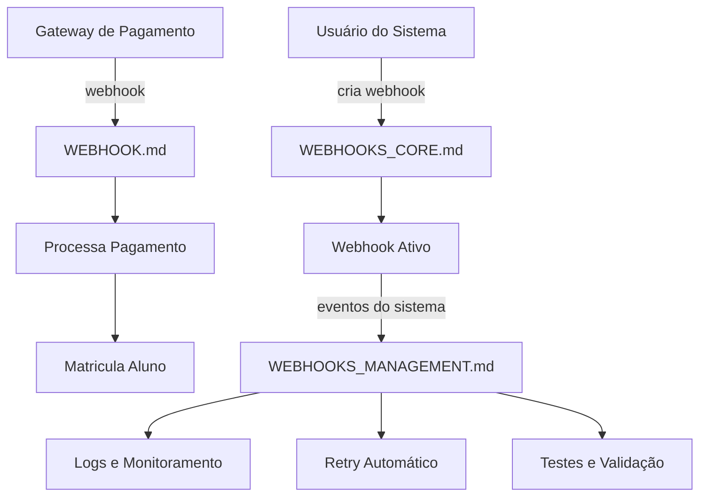

# 🔗 Esclarecimento - Sistemas de Webhook

## 📋 Diferenças entre os 3 Sistemas de Webhook

Os três arquivos de webhook do sistema **NÃO SÃO DUPLICADOS** - cada um tem propósitos específicos:

### 1. 🔗 **WEBHOOK.md** - Processamento Automático
- **Arquivo**: `routes/webhook.js`
- **Função**: Receber webhooks de gateways de pagamento externos
- **Uso**: Processamento automático de pagamentos e matrículas
- **Acesso**: Endpoints públicos para gateways externos

**Principais Endpoints:**
- `POST /api/webhook/payment-approved` - Processa pagamentos aprovados
- `POST /api/webhook/payment-rejected` - Processa pagamentos rejeitados
- `POST /api/webhook/subscription-renewed` - Renovações automáticas

**Exemplo de Uso:**
```javascript
// Gateway externo chama automaticamente
POST /api/webhook/payment-approved
{
  "orderId": "order_123",
  "paymentMethod": "credit_card",
  "status": "approved"
}
// Sistema automaticamente matricula aluno no curso
```

---

### 2. ⚙️ **WEBHOOKS_CORE.md** - CRUD de Webhooks do Usuário
- **Arquivo**: `routes/webhooks.js`
- **Função**: CRUD básico para webhooks criados pelo usuário
- **Uso**: Usuários criam webhooks para receber eventos do sistema
- **Acesso**: Rotas autenticadas para usuários

**Principais Endpoints:**
- `GET /api/webhooks` - Listar webhooks do usuário
- `POST /api/webhooks` - Criar webhook
- `PUT /api/webhooks/:id` - Atualizar webhook
- `DELETE /api/webhooks/:id` - Deletar webhook

**Exemplo de Uso:**
```javascript
// Usuário cria webhook para seu CRM
POST /api/webhooks
{
  "name": "CRM Integration",
  "url": "https://meu-crm.com/webhook",
  "events": ["order.created", "sale.completed"]
}
```

---

### 3. 🛠️ **WEBHOOKS_MANAGEMENT.md** - Gerenciamento Avançado
- **Arquivo**: `routes/webhooksManagement.js`
- **Função**: Sistema avançado de gerenciamento de webhooks
- **Uso**: Funcionalidades avançadas como logs, testes, retry, monitoramento
- **Acesso**: Rotas autenticadas com funcionalidades premium

**Principais Endpoints:**
- `GET /api/webhooks/:id/logs` - Logs detalhados de execução
- `POST /api/webhooks/:id/test` - Testar webhook com payload real
- `GET /api/webhooks/events/available` - Eventos disponíveis
- Sistema de retry automático
- Monitoramento de falhas

**Exemplo de Uso:**
```javascript
// Testar webhook antes de ativar
POST /api/webhooks/webhook_123/test
// Sistema envia payload de teste e retorna resultado

// Ver logs de execução
GET /api/webhooks/webhook_123/logs
// Retorna histórico detalhado de todas as execuções
```

---

## 🎯 Quando Usar Cada Sistema

### 🔗 Use **WEBHOOK.md** quando:
- ✅ Receber notificações de gateways de pagamento
- ✅ Processar automaticamente pagamentos aprovados/rejeitados
- ✅ Integrar com sistemas externos que enviam webhooks
- ✅ Matrículas automáticas em cursos após pagamento

### ⚙️ Use **WEBHOOKS_CORE.md** quando:
- ✅ Permitir usuários criarem seus próprios webhooks
- ✅ CRUD básico de webhooks
- ✅ Integração simples com sistemas dos usuários
- ✅ Eventos básicos do sistema (order.created, sale.completed)

### 🛠️ Use **WEBHOOKS_MANAGEMENT.md** quando:
- ✅ Precisar de logs detalhados de webhooks
- ✅ Testar webhooks antes de ativá-los
- ✅ Monitorar performance e falhas
- ✅ Sistema de retry automático
- ✅ Gerenciamento empresarial de webhooks

---

## 🔄 Fluxo Completo de Webhook



---

## 📊 Comparação Rápida

| Característica | WEBHOOK.md | WEBHOOKS_CORE.md | WEBHOOKS_MANAGEMENT.md |
|---|---|---|---|
| **Propósito** | Receber de externos | CRUD de usuário | Gerenciamento avançado |
| **Autenticação** | Pública | Requerida | Requerida |
| **Complexidade** | Simples | Média | Avançada |
| **Logs** | Básicos | Básicos | Detalhados |
| **Retry** | Manual | Automático | Automático + Config |
| **Testes** | Não | Simples | Avançados |
| **Monitoramento** | Não | Básico | Completo |

---

## ✅ Conclusão

**Os três sistemas são complementares e não duplicados:**

1. **WEBHOOK.md** = Entrada de dados externos
2. **WEBHOOKS_CORE.md** = Criação de webhooks pelos usuários  
3. **WEBHOOKS_MANAGEMENT.md** = Gerenciamento empresarial

Cada um atende necessidades específicas do ecossistema de webhooks do CheckoutPro.

---

**Status**: ✅ Verificado - Não há duplicação  
**Recomendação**: Manter os três sistemas independentes  
**Documentação**: Completa e diferenciada
